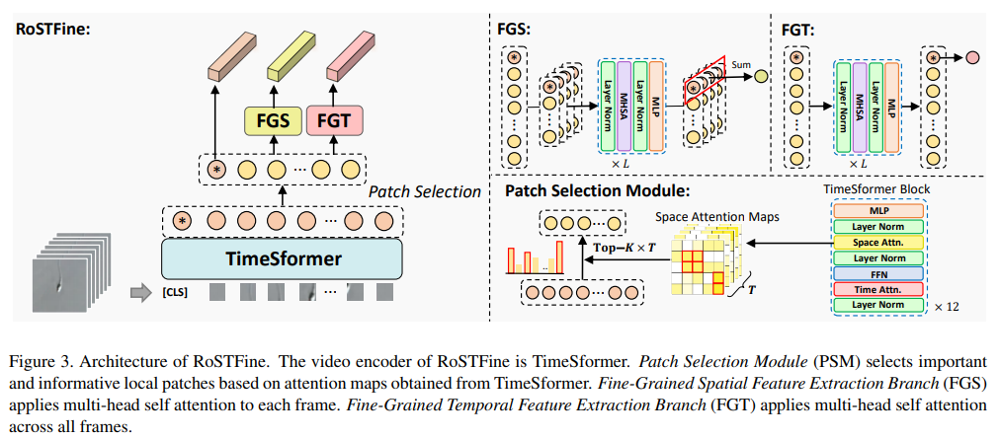
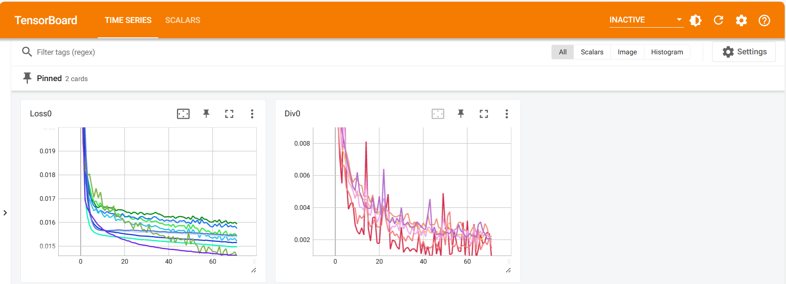
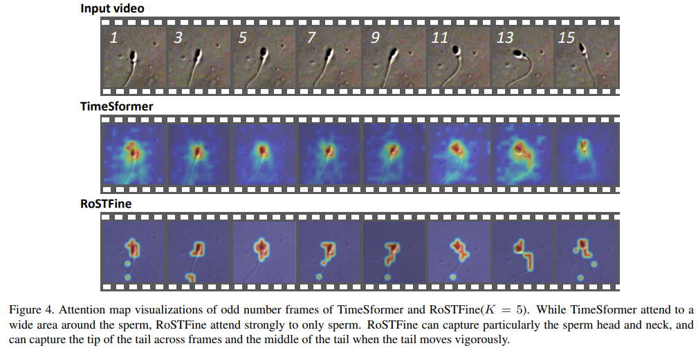

# Automated Sperm Assessment Framework and Neural Network Specialized for Sperm Video Recognition (WACV 2024)

This is the official implementation of the paper titled: "Automated Sperm Assessment Framework and Neural Network Specialized for Sperm Video Recognition".
This paper has been accepted to the 2024 IEEE/CVF Winter Conference on Applications of Computer Vision (WACV 2024). [Paper]

(Please rewrite the dataloader in [make_dataloader.py](dataloader/make_dataloader.py) for your dataset, since our dataset cannot be released.)
## 1. Requirements
- Python == 3.8.5
- PyTorch == 1.8.1
## 2. Installation
### 2.1 PyTorch
```shell
pip install torch==1.8.1+cu101 torchvision==0.9.1+cu101 torchaudio==0.8.1 -f https://download.pytorch.org/whl/torch_stable.html
```
### 2.2 Other Python packages
```shell
pip install -r requirements.txt
```
## 3. Download Pretrained Model
### TimeSformer
We use TimeSformer of [official implementation](https://github.com/facebookresearch/TimeSformer) and change TimeSformer module to obtain spatial attention maps. You can install our changed timesformer framework in the following way:
```shell
cd TimeSformer
pip install -e .
```
Download pretrained model as follows:
```shell
cd download_model
wget https://www.dropbox.com/s/g5t24we9gl5yk88/TimeSformer_divST_8x32_224_K400.pyth
```
### ViViT
We use ViViT of [unofficial implementation](https://github.com/mx-mark/VideoTransformer-pytorch) because pretrained ViViT is available. Download pretrained model as follows:
```shell
cd download_model
curl -sc /tmp/cookie "https://drive.google.com/uc?export=download&id=1-JVhSN3QHKUOLkXLWXWn5drdvKn0gPll" > /dev/null
CODE="$(awk '/_warning_/ {print $NF}' /tmp/cookie)"  
curl -Lb /tmp/cookie "https://drive.google.com/uc?export=download&confirm=${CODE}&id=1-JVhSN3QHKUOLkXLWXWn5drdvKn0gPll" -o vivit_model.pth
```
You should structure download_model in the following way:
```
/download_model/
  ├── download_model.sh
  ├── TimeSformer_divST_8x32_224_K400.pyth
  ├── vivit_model.pth 
```
## 4. Training
### Baselines
We lineup R3D, R(2+1)D, I3D, X3D, SlowFast, ViViT, and TimeSformer as baselines. Where, we take up VGG16 trained on first frame images as a lower bound.
For training baseline models, a sample script is as follows:
```shell
python train.py \
    --model_name {MODEL_NAME} \
    --batch_size 16 \
    --epochs 300 \
```
or
```shell
bash scripts/train_timesformer.sh
```
### RoSTFine
For training our RoSTFine, a sample script is as follows:
```shell
python train.py \
    --num_frame 8 \
    --model_name rostfine \
    --use_div gs+gt+st \
    --use_feat vg+vs+vt \
    --alpha 1.0 \
    --topk 3 \
    --batch_size 16 \
    --epochs 300 \
```
- `--use_div` which feature-feature diversity losses are used during training.
- `--use_feat` which features in `vg`, `vs` and `vt` are used during training.
- `--alpha` the weight of the diversity loss.
- `--topk` how many patches Patch Selection Module chooses.

or
```shell
bash scripts/train_rostfine.sh
```
### Tensorborad
We can monitor training processes by tensorboard.
```shell
tensorboard --logdir dir/to/tensorboard/in/output_dir
```
example:

## 5. Test
### Baselines
For testing baselines, a sample script is as follows:
```shell
python test.py \
    --load_dir dir/to/training \
    --use_metrics mse+js+balanced_acc \
    --model_name {MODEL_NAME} \
    --batch_size 64 \
```
- `--use_metrics` which metrics for evaluation are used.
### RoSTFine
For testing our RoSTFine, a sample script is as follows:
```shell
python test.py \
    --load_dir dir/to/training \
    --use_metrics mse+js+balanced_acc \
    --model_name rostfine \
    --use_feat vg+vs+vt \
    --batch_size 64 \
```
- `--use_metrics` which metrics for evaluation are used.
## 6. Results
We show some main results. Please read our paper for more details.
### 6.1 Comparison to Baselines
| **Method** |  **MSE** ($10^{-2}$)  | **JS div.** ($10^{-2}$) | **Balanced Acc. (1st)** |
|:----------------------|:-----:|:-----:|:-----:|
| VGG16                 | 1.517 | 5.628 | 26.49 |
| R3D                   | 1.365 | 4.978 | 28.72 |
| R(2+1)D               | 1.702 | 7.043 | 29.83 |
| X3D                   | 1.808 | 7.186 | 27.65 |
| I3D                   | 1.376 | 5.206 | 30.28 |
| SlowFast              | 1.346 | 5.059 | 31.58 |
| ViViT                 | 1.406 | 4.987 | 27.37 |
| TimeSformer           | 1.186 | 4.283 | 31.43 |
| RoSTFine ($\alpha=0$) | 1.121 | 4.145 | 33.48 |
| RoSTFine ($\alpha=1$) | 1.104 | 4.109 | 35.61 |
### 6.2 Attention Maps

## Citation
```
@inproceedings{takuro2024rostfine,
    title={Automated Sperm Assessment Framework and Neural Network Specialized for Sperm Video Recognition},
    author={Takuro Fujii and Hayato Nakagawa and Teppei Takeshima and Yasushi Yumura and Tomoki Hamagami},
    booktitle={Proceedings of the IEEE/CVF Winter Conference on Applications of Computer Vision (WACV)},
    year={2024}
    pages = {xxxx-xxxx}
}
```